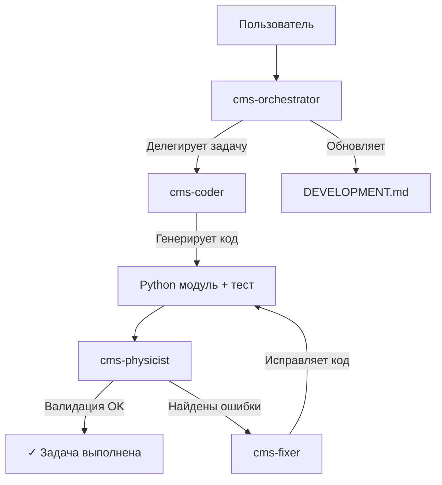

# Cloud Modeling System (CMS)

[](https://www.python.org/)
[](DEVELOPMENT.md)
[](LICENSE)

## Обзор

**Cloud Modeling System (CMS)** — это высокопроизводительный модульный Python-фреймворк, разработанный для симуляции атмосферной термодинамики, облачной микрофизики и сценариев модификации погоды (сидинга).

Система построена на **модульной гибридной Эйлеровой-Лагранжевой** архитектуре с приоритетами:
* **Разделение ответственности:** Динамика, микрофизика и диффузия разделены
* **Векторизация:** Ключевые численные операции используют `numpy` для производительности
* **Конфигурируемость:** Физические константы и параметры сетки строго изолированы

## Структура проекта

```text
cms/
├── core/           # Численный базис (Grid, Stencils, RK-интеграторы)
├── dynamics/       # Решатели Навье-Стокса (Адвекция, Давление, Плавучесть)
├── microphysics/   # Фазовые переходы (Kessler, Morrison, Взаимодействие с сидингом)
├── diffusion/      # Моделирование турбулентности (LES, Smagorinsky)
└── utils/          # Ввод-вывод данных (NetCDF), Логирование, Диагностика
```

## Документация

* **[IMPLEMENTATION_GUIDE.md](IMPLEMENTATION_GUIDE.md)**: **Источник истины** для всех физических уравнений, констант и алгоритмов
* **[DEVELOPMENT.md](DEVELOPMENT.md)**: Текущий roadmap, активная фаза и статус реализации
* **[GEMINI.md](GEMINI.md)**: Контекст и инструкции для AI-ассистированной разработки

## Начало работы

### Требования

* Python 3.10 или выше
* Виртуальное окружение (рекомендуется)

### Установка

1. Склонируйте репозиторий:
   ```bash
   git clone https://github.com/f2re/cloud-modeling-system.git
   cd cloud-modeling-system
   ```

2. Создайте и активируйте виртуальное окружение:
   ```bash
   python -m venv venv
   source venv/bin/activate  # Linux/Mac
   # или
   venv\Scripts\activate  # Windows
   ```

3. Установите зависимости:
   ```bash
   pip install -r requirements.txt
   ```

### Запуск тестов

Для проверки установки и текущих реализованных модулей:
```bash
python -m unittest discover tests -v
```

## AI-ассистированная разработка

Этот проект использует систему Gemini CLI skills для автоматизированного workflow разработки.

### Доступные навыки (Skills)

* **cms-orchestrator**: Управление roadmap проекта и координация задач
* **cms-coder**: Специалист по научной реализации на Python
* **cms-physicist**: Валидация физики и контроль качества
* **cms-fixer**: Автоматическая отладка и исправление ошибок

### Использование с Gemini CLI

```bash
# Активация оркестратора
gemini --skill .gemini/skills/cms-orchestrator

# Запрос следующей задачи
"Что делать дальше?"

# Запрос конкретной реализации
"Реализуй уравнение 3.5.1 (автоконверсия) согласно IMPLEMENTATION_GUIDE"
```

### Рабочий процесс

1. **Оркестратор** анализирует статус фазы в DEVELOPMENT.md
2. **Делегирует** реализацию cms-coder со ссылками на уравнения
3. **Валидирует** через cms-physicist против физических законов
4. **Автоматически исправляет** проблемы через cms-fixer
5. **Обновляет** roadmap после прохождения тестов

### Примеры взаимодействия

**Запрос статуса:**
```
> "Какова текущая фаза разработки?"

Оркестратор анализирует DEVELOPMENT.md:
→ Фаза 5: Аэрозольные взаимодействия (60% выполнено)
→ Следующая задача: Активация CCN (уравнение 3.6)
→ Требования: Phase 3-4 завершены ✓
```

**Реализация функции:**
```
> "Реализуй расчёт терминальной скорости"

cms-coder создаёт код:
→ Использует уравнение 3.4 из IMPLEMENTATION_GUIDE
→ Применяет векторизацию numpy
→ Добавляет type hints и docstring
→ Создаёт unit test в tests/

cms-physicist валидирует:
→ Проверяет константы против таблицы 13
→ Верифицирует показатели степени
→ Возвращает {"status": "passed"}
```

**Отладка:**
```
> "Тесты в test_ice.py падают"

cms-fixer анализирует:
→ Читает traceback и отчёт physicist
→ Находит несоответствие в уравнении 3.5.2
→ Применяет исправление
→ Перезапускает тесты → ✓ Pass
```

## Архитектура AI-системы



### Гарантии качества

Каждая реализация проходит строгую проверку:

1. **Физическая корректность**: Все уравнения сверяются с IMPLEMENTATION_GUIDE.md
2. **Сохранение законов**: Проверка консервации массы, энергии, импульса
3. **Численная устойчивость**: Верификация условий CFL и положительной определённости
4. **Единообразие единиц**: Все величины в системе СИ (kg/kg, m/s, Pa)
5. **Покрытие тестами**: Каждый модуль имеет соответствующий unit test

## Текущий статус разработки

### Завершённые фазы

* ✅ **Фаза 1**: Инфраструктура (Grid, Time Integration, Basic Advection)
* ✅ **Фаза 2**: Динамика (Compressible Navier-Stokes, WENO-5)
* ✅ **Фаза 3**: Базовая микрофизика (Kessler warm rain)
* ✅ **Фаза 4**: Продвинутая физика (Ice phase, AgI seeding)

### Активная фаза

* 🔄 **Фаза 5**: Продвинутые функции (Aerosol-cloud interactions, LES refinement)

Подробный прогресс см. в [DEVELOPMENT.md](DEVELOPMENT.md).

## Вклад в проект

Пожалуйста, обратитесь к `DEVELOPMENT.md` для текущих задач и стандартов кодирования.

* **Ветвление**: Используйте ветки `feature/<topic>`
* **Коммиты**: Используйте описательные, атомарные коммиты
* **Валидация**: Все изменения должны проходить unit тесты и соответствовать физическому руководству

### Рабочий процесс разработки

1. Выберите задачу из DEVELOPMENT.md
2. Используйте Gemini CLI для генерации кода:
   ```bash
   gemini --skill .gemini/skills/cms-orchestrator
   > "Реализуй следующую незавершённую задачу"
   ```
3. Проверьте сгенерированный код
4. Запустите тесты: `python -m unittest discover tests -v`
5. Создайте PR с описанием реализованных уравнений

### Стандарты кодирования

* **Стиль**: PEP 8
* **Документация**: Docstrings для всех публичных функций/классов
* **Ссылки на уравнения**: Каждая функция должна ссылаться на конкретное уравнение из IMPLEMENTATION_GUIDE
* **Векторизация**: Используйте numpy array операции, избегайте явных циклов
* **Точность**: Используйте `np.float64` для всех прогностических переменных

## Физические особенности

### Микрофизика облаков

* **Double-moment scheme**: Предсказывает массу (q_x) и концентрацию числа (N_x)
* **Категории гидрометеоров**: Облачные капли, дождь, лёд, снег, крупа
* **Фазовые процессы**: Автоконверсия, аккреция, нуклеация льда, таяние, замерзание

### Сидинг йодидом серебра

* **Гетерогенная нуклеация**: Эффективность зависит от температуры и размера частиц
* **Оптимальный размер AgI**: 50-200 нм для максимальной эффективности
* **Вторичное образование льда**: 3 механизма (Hallett-Mossop, collisional breakup, sublimational breakup)
* **Конкуренция**: Учёт взаимодействия между естественными INP и AgI

### Численные методы

* **Временная интеграция**: 5-стадийный Runge-Kutta (SSP-RK5)
* **Пространственная дискретизация**: 5-го порядка WENO для адвекции
* **Турбулентность**: LES с моделью Smagorinsky
* **Условие устойчивости**: CFL ≤ 0.5

## Ссылки

* **Физическое руководство**: [IMPLEMENTATION_GUIDE.md](IMPLEMENTATION_GUIDE.md)
* **План разработки**: [DEVELOPMENT.md](DEVELOPMENT.md)
* **AI контекст**: [GEMINI.md](GEMINI.md)
* **Тесты**: [tests/](tests/)

## Лицензия

MIT License

---

**Версия**: 1.0  
**Последнее обновление**: 30 января 2026  
**Статус**: Активная разработка (Фаза 5)

Для вопросов и предложений создавайте issues или используйте Gemini CLI для автоматизированной разработки.
